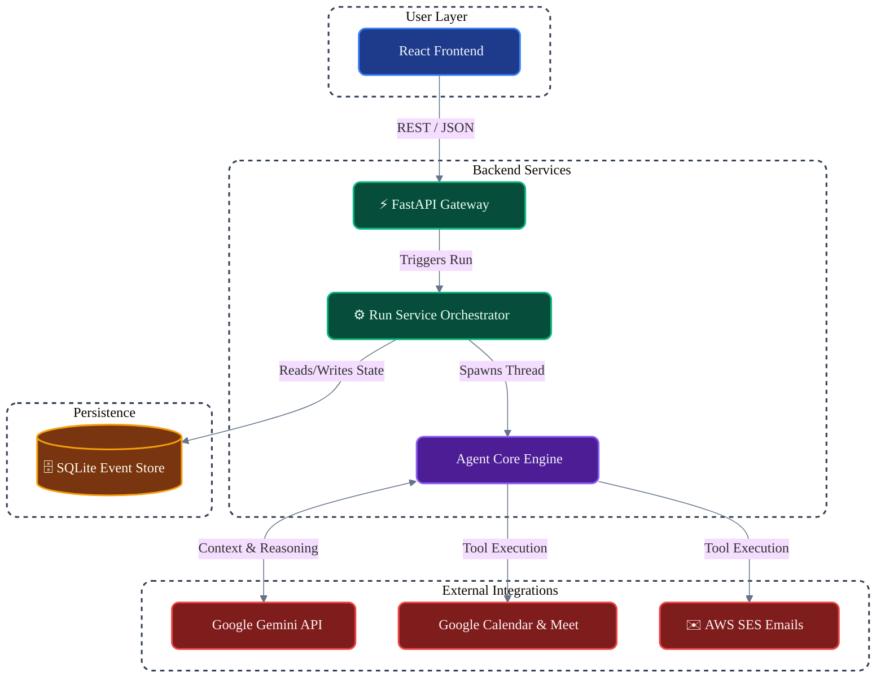

# 🧠 Cerevyn: Autonomous AI Orchestration Engine

An enterprise-grade, full-stack autonomous AI agent system designed to handle complex scheduling, context reasoning, and operational logistics. Built with **FastAPI** and **React**, and powered by the advanced reasoning capabilities of **Google Gemini**.

---

## 🚀 Overview
Cerevyn goes beyond standard chatbot architecture. It is a stateful, autonomous backend engine that transforms natural language intent into a coordinated series of API executions. It features a self-correcting reasoning loop, persistent memory, and real-time external integrations.

### Core Intelligence
- **Autonomous Reasoning Loop**: The agent dynamically decomposes tasks, executes tools, evaluates the output, and dictates its next steps without hardcoded scripts.
- **Human-in-the-Loop (HITL)**: If the agent detects missing context (e.g., a missing email address) or encounters an API conflict (e.g., a booked calendar slot), it seamlessly suspends execution, requests human clarification, and resumes state.
- **Event-Sourced Memory**: Every thought, tool call, and state change is immutably logged to a SQLite persistence layer, allowing the frontend to render the agent's exact "thought process" in real-time.

---

## ✨ Key Functionalities

### 1. Enterprise Tool Orchestration
- **Google Workspace Native**: Secure OAuth 2.0 and Service Account flows to programmatically read availability, create Google Calendar events, and generate active Google Meet spaces.
- **AWS SES Integration**: Transforms AI-generated plain text into polished, responsive HTML emails with injected metadata cards and reliable delivery.

### 2. High-Performance Architecture
- **Asynchronous Execution**: Web requests are immediately acknowledged while heavy LLM reasoning and API calls are offloaded to background threads, ensuring zero UI blocking.
- **Strict Data Contracts**: Enforces ironclad data integrity between the AI engine and external APIs using Pydantic schemas.

### 3. Adaptive Intelligence
- **Self-Correction**: If a tool fails (e.g., `409 Conflict` on a calendar slot), the agent reads the error, understands the failure, and autonomously pivots its strategy.
- **Local Time Awareness**: Automatically normalizes user prompts (e.g., "tomorrow at 2 PM") against local timezones into strict UTC for reliable server-side execution.

---

## 🏗️ System Architecture

Cerevyn strictly separates web routing, business logic, AI orchestration, and persistence.

## 🛠️ Setup & Installation
## Prerequisites

**•  Python 3.9+**

**•  Node.js (v18+) for the Frontend**

**•  Google Cloud Console Project (OAuth Credentials & Calendar/Meet APIs enabled)**

**•  AWS Account (SES Verified Identities)**

**•  Google Gemini API Key**

## 1. Backend Setup (/src)

**Clone the repository and navigate to the root directory.**

### a)Create and activate a virtual environment

**python -m venv .venv**

**source .venv/bin/activate  # On Windows: .venv\Scripts\activate**

### b)Install dependencies

**pip install -r requirements.txt**

**Configure .env file:**

**Create a .env file in the root directory**

### c)AI Engine
**GEMINI_API_KEY=your_gemini_api_key**

**GEMINI_MODEL_NAME=gemini-3.1-pro-preview**

### d)Google Integration
**CLIENT_ID=your_google_client_id**

**CLIENT_SECRET=your_google_client_secret**

**GOOGLE_OAUTH_REDIRECT_URI=http://127.0.0.1:8000/auth/google/callback**

### e)AWS Integration
**AWS_REGION=us-east-1**

**AWS_SES_SENDER_EMAIL=your_verified_email@domain.com**

### f)Launch the API:

**uvicorn main:app --reload --host 0.0.0.0 --port 8000**

## 2. Frontend Setup (/frontend)

**cd frontend**

**npm install**

**npm run dev**

#### Ensure the frontend is configured to point to http://localhost:8000 for API requests.

## 📱 Usage Guide: 

**• Authenticate: Navigate to the UI and connect your Google Calendar via the OAuth flow.**

**• Dispatch a Task: Input a complex prompt (e.g., "Set up a 45-minute sync with design@company.com tomorrow afternoon.")**

**• Monitor the Run: Watch the live event feed as the agent parses the request, executes the Calendar tool, and dispatches the AWS email.**

**• Human Interaction: If the agent requires input (e.g., conflicting schedule), an interactive prompt will appear in the UI. Respond to resume the agent's background execution seamlessly.**

## 🛡️ Developer Notes:
**• State Management: The SQLite database (cerevyn_runs.sqlite) safely persists runs across server restarts. You can blow it away to clear history during testing.**

**• OAuth Scopes: Ensure your Google Cloud app requests https://www.googleapis.com/auth/calendar and https://www.googleapis.com/auth/meetings.space.created.**

## 👤 Author

### Indeevarashyam Mahanthi

### 📧 indeevarmsv@gmail.com

### 📁 Project: Submission PS-3

